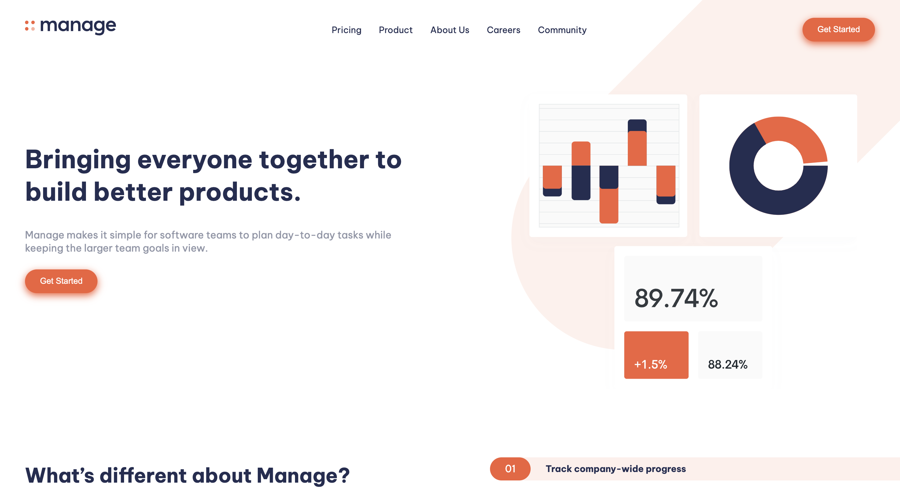

# Frontend Mentor - Manage landing page solution

This is a solution to the [Manage landing page challenge on Frontend Mentor](https://www.frontendmentor.io/challenges/manage-landing-page-SLXqC6P5). 

## Table of contents

- [Overview](#overview)
  - [The challenge](#the-challenge)
  - [Screenshot](#screenshot)
  - [Links](#links)
- [My process](#my-process)
  - [Built with](#built-with)
  - [Useful resources](#useful-resources)
- [Author](#author)

## Overview

### The challenge

Users should be able to:

- View the optimal layout for the site depending on their device's screen size
- See hover states for all interactive elements on the page
- See all testimonials in a horizontal slider
- Receive an error message when the newsletter sign up `form` is submitted if: (in progress)
  - The `input` field is empty
  - The email address is not formatted correctly

### Screenshot

### Links

- Solution URL: (https://deed1996.github.io/Manage-Landing-Page/)

## My process

### Built with

- Semantic HTML5 markup
- Mobile-first workflow
- SCSS
- Vanilla JavaScript

### Useful resources

- [How to Make a Landing Page using HTML, SCSS, and JavaScript - Full Course](https://youtu.be/aoQ6S1a32j8) - This is an amazing tutorial which helped me understand how to build a landing page from scratch with SCSS. I'd recommend it to anyone still learning this concept!

## Author

- Website - Devarshi Desai
- Frontend Mentor - @deed1996
